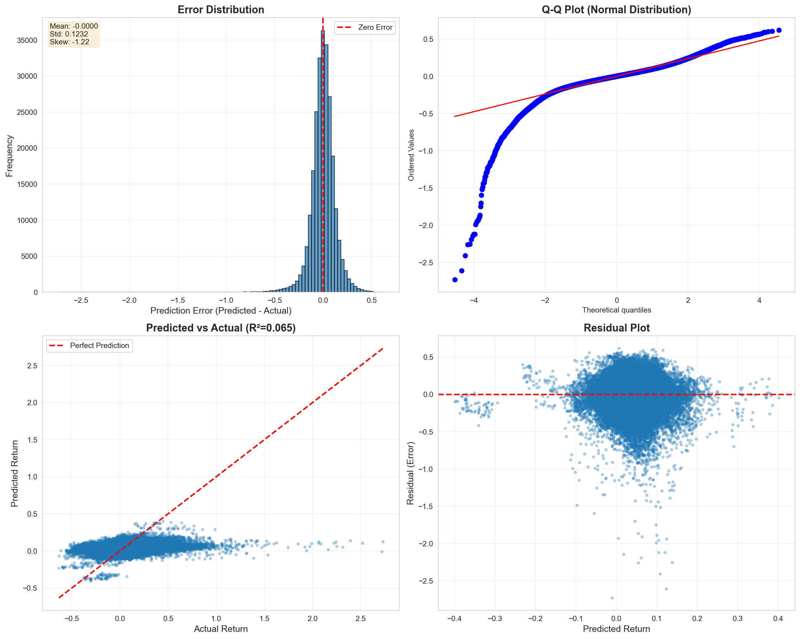
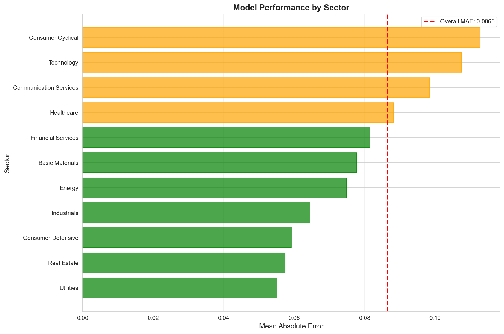

# How to Evaluate Models

Quick reference guide for running model evaluations.

## Quick Start

```bash
# Evaluate baseline model (default)
python scripts/evaluate_model.py

# Evaluate specific model
python scripts/evaluate_model.py --model-dir models/my_model

# Evaluate on different dataset
python scripts/evaluate_model.py --data-path data/validation/val_data.parquet
```

## Output

Evaluation creates a timestamped directory in `reports/` with:

```
reports/YYYYMMDD_HHMMSS/
├── evaluation_report.txt          # Full text report
├── error_distribution.png          # Error analysis visualizations
├── temporal_performance.png        # Performance over time
├── sector_performance.png          # Performance by sector
└── feature_importance.png          # Top features by coefficient
```

## What Gets Analyzed

### 1. Performance Metrics
- **R² Score**: Variance explained (0.065 = 6.5%)
- **RMSE**: Root mean squared error (12.32%)
- **MAE**: Mean absolute error (8.65%)
- **Directional Accuracy**: % of correct direction predictions (57%)
- **MAPE**: Mean absolute percentage error

### 2. Error Statistics
- **Bias**: Mean error (systematic over/under prediction)
- **Skewness**: Asymmetry of error distribution
- **Kurtosis**: Tail heaviness (outlier frequency)

### 3. Temporal Analysis
- Monthly MAE trends
- Yearly performance comparison
- Performance degradation check

### 4. Sector Analysis
- Performance by sector
- Best/worst performing sectors
- Sector-specific opportunities

### 5. Feature Importance
- Top features by coefficient magnitude
- Positive vs negative influence
- Feature categories (technical, fundamental, market)

## Interpreting Results

### R² Score
- **< 0**: Model worse than predicting mean (bad)
- **0 - 0.05**: Typical for stock prediction (okay)
- **0.05 - 0.15**: Good for stocks (excellent)
- **> 0.15**: Exceptional (check for overfitting)

### Directional Accuracy
- **< 50%**: No predictive power (useless)
- **50 - 52%**: Weak signal (not tradeable)
- **52 - 55%**: Moderate signal (potentially tradeable)
- **55 - 60%**: Strong signal (tradeable)
- **> 60%**: Exceptional (check for data leakage)

### MAE (Mean Absolute Error)
- **< 5%**: Excellent
- **5 - 10%**: Good (current: 8.65%)
- **10 - 15%**: Acceptable
- **> 15%**: Poor

### Bias (Mean Error)
- **Near 0**: Well-calibrated (current: -0.0000)
- **> |0.01|**: Systematic bias (adjust predictions)

## Common Insights

### "Heavy-tailed errors detected"
**Meaning**: Model has many outliers (large errors)
**Action**: Use robust loss functions (Huber, quantile regression)

### "Performance degrading over time"
**Meaning**: Model performs worse on recent data
**Action**: Retrain model with recent data, check for regime change

### "Large sector performance variation"
**Meaning**: Model works better for some sectors
**Action**: Train sector-specific models

### "Model has bias"
**Meaning**: Systematically over/under predicting
**Action**: Adjust predictions by bias, investigate feature drift

### "Strong directional accuracy"
**Meaning**: Model predicts direction well (even if magnitude is off)
**Action**: Build long/short strategy, rank-based portfolios

## Comparing Models

After running evaluations for multiple models, compare:

```python
# Example comparison
Model A (baseline):     R²=0.065, MAE=8.65%, Dir=57.0%
Model B (ensemble):     R²=0.095, MAE=7.80%, Dir=58.5%
Model C (sector-specific): R²=0.110, MAE=7.20%, Dir=59.2%

→ Model C is best overall
```

Key metrics to compare:
1. **Directional Accuracy** (most important for trading)
2. **MAE** (easier to interpret than RMSE)
3. **R²** (variance explained)
4. **Temporal stability** (consistent performance)

## Troubleshooting

### "No sector information available"
- Dataset missing 'sector' column
- Run: `python scripts/fetch_metadata.py` to add sectors

### "Could not get feature names from preprocessor"
- Preprocessor not saved properly
- Retrain model with updated scripts

### "ValueError: X contains infinity"
- Data preprocessing issue
- Update preprocessing pipeline (outlier clipping)

### Plots look weird
- Check date range (too short/long)
- Verify data quality (missing values)
- Check feature distributions (extreme outliers)

## Best Practices

### 1. Run After Every Model Change
```bash
# Train model
python scripts/train_baseline_model.py

# Immediately evaluate
python scripts/evaluate_model.py
```

### 2. Save Important Reports
```bash
# Copy report to named directory
cp -r reports/20251023_203823 reports/baseline_v1
```

### 3. Track Metrics Over Time
Create a metrics log:
```
baseline_v1:    R²=0.065, MAE=8.65%, Dir=57.0%
baseline_v2:    R²=0.072, MAE=8.40%, Dir=57.5%  (added features)
ensemble_v1:    R²=0.095, MAE=7.80%, Dir=58.5%  (random forest)
```

### 4. Focus on Directional Accuracy
For trading, directional accuracy matters most:
- 57% accuracy = profitable with good risk management
- 52% accuracy = breakeven after costs
- 50% accuracy = coin flip (useless)

### 5. Check Temporal Stability
Look at monthly MAE plot:
- Flat line = stable (good)
- Upward trend = degrading (retrain)
- High variance = unstable (investigate)

## Example Workflow

```bash
# 1. Train model
python scripts/train_baseline_model.py

# 2. Evaluate
python scripts/evaluate_model.py

# 3. Review report
cat reports/20251023_203823/evaluation_report.txt

# 4. Look at plots
open reports/20251023_203823/*.png

# 5. Make improvements based on insights
# - Add features if MAE high
# - Try ensemble if R² low
# - Use robust loss if heavy tails
# - Train sector models if sector variation

# 6. Repeat
python scripts/train_improved_model.py
python scripts/evaluate_model.py
```

## Advanced: Custom Analysis

Extend the evaluator for custom analysis:

```python
from scripts.evaluate_model import ModelEvaluator

# Create evaluator
evaluator = ModelEvaluator(model_dir='models/baseline')
evaluator.load_model()
evaluator.load_data()
evaluator.generate_predictions()

# Custom analysis
predictions_df = evaluator.predictions_df

# Example: Analyze by market cap
predictions_df.group_by('market_cap_bucket').agg([
    pl.col('abs_error').mean().alias('mae')
])

# Example: Analyze by volatility
predictions_df.group_by('volatility_bucket').agg([
    pl.col('error').mean().alias('bias')
])
```

## Visualization Examples

### Error Distribution


**What to look for**:
- Centered at 0? (no bias)
- Symmetric? (no skewness)
- Heavy tails? (outliers)
- Q-Q plot deviates? (non-normal)

### Temporal Performance


**What to look for**:
- MAE trend (flat = stable)
- Seasonal patterns
- Recent degradation

### Sector Performance


**What to look for**:
- Large variation between sectors
- Sectors above/below average
- Opportunities for specialization

## Questions?

Check these docs:
- Model evaluation summary: `docs/model_evaluation_summary.md`
- Missing data strategy: `docs/missing_data_strategy.md`
- Architecture overview: `docs/architecture.md`
